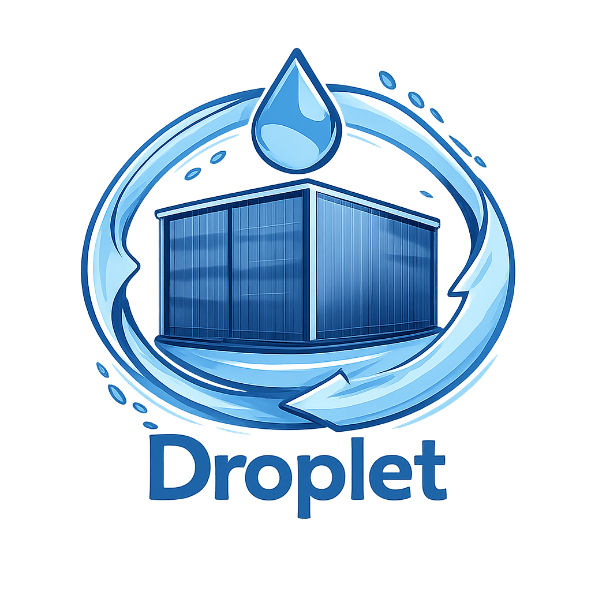

# Droplet
<p>
  
</p>

Droplet is one of the components of the Raind container runtime stack and serves as the low-level container runtime.
It is OCI-compliant and is responsible for mounting filesystems based on `config.json`, applying resource limits, configuring capabilities, and launching containers.

## Runtime Stack Architecture

The Raind container runtime stack is composed of three layers:

- **Raind CLI** – A user interface for operating the entire runtime stack  
- **Condenser** – A high-level container runtime responsible for container lifecycle and image management  
  (repository: https://github.com/pyxgun/Condenser)
- **Droplet** – A low-level container runtime that handles container startup, deletion, and related operations (this repository)

## Features

Droplet currently supports:

- Generation and parsing of OCI-compliant `config.json`
- Mounting filesystems and user-specified directories
- CPU and memory resource limits (cgroups)
- Network interface configuration
- OCI lifecycle hooks
- Capability set configuration
- Seccomp
- AppArmor
- Pseudo-terminals (shim/pty)

## Build

### Requirements
- Linux kernel with namespace & cgroup support
- Go (version 1.25 or later)
- root privileges (or appropriate capabilities)

```bash
git clone https://github.com/your-org/droplet.git
cd droplet
./scripts/build.sh
```

## Usage
Droplet is designed to be invoked by Condenser or the Raind CLI, but it can also be used directly for development and testing.

### Pre-required Setup
Some processes, such as creating runtime directories, setting up cgroups/network devices, and retrieving images, are handled by the high-level container runtime.
When running on a Droplet alone, you must manually set up these components using the provided setup scripts and Docker commands.
```bash
# all script/command required as sudo 

# setup raind environment
./scripts/setup/setup_bundle_dir.sh
./scripts/setup/setup_cgroup.sh
./scripts/setup/setup_network.sh

# image retrieve
cd /etc/raind/image/layers
docker export $(docker create alpine) | tar -C alpine -xvf -
```

### Command Example
```bash
# create config.json
#  use spec command or sample scripts
#  spec command
./bin/droplet spec \
  --rootfs "/etc/raind/container/<container-id>/merged" \
  --cwd "/" \
  --command "/bin/sh" \
  --ns "mount" --ns "network" --ns "uts" --ns "pid" --ns "ipc" --ns "user" --ns "cgroup" \
  --hostname "11111" \
  --host_if_name "eth0" --bridge_if_name "raind0" \
  --if_name "eth0" --if_addr "10.166.0.1/24" --if_gateway "10.166.0.254" --dns "8.8.8.8" \
  --image_layer "/etc/raind/image/layers/alpine" \
  --upper_dir "/etc/raind/container/11111/diff" --work_dir "/etc/raind/container/11111/work" \
  --hook-create-runtime "/bin/sh,-c,cat > /tmp/create-runtime_state.json" \
  --hook-create-container "/bin/sh,-c,cat > /tmp/create-container_state.json" \
  --hook-start-container "/bin/sh,-c,cat > /tmp/start-container_state.json" \
  --hook-poststart "/bin/sh,-c,cat > /tmp/poststart_state.json" \
  --hook-poststop "/bin/sh,-c,cat > /tmp/poststop_state.json" \
  --output "/etc/raind/container/11111"
# spec scripts
./scripts/sample/create_spec.sh

# create
./bin/droplet create <container-id>
# start
./bin/droplet start <container-id>
# run (if you want to start interactive mode (e.g. /bin/sh), use run with -i,--interactive)
./bin/droplet run [-i] <container-id>
# stop
./bin/droplet stop <container-id>
# delete
./bin/droplet delete <container-id>
# exec command in container (if you want to start interactive mode (e.g. /bin/sh), use run with -i,--interactive)
./bin/droplet exec [-i] <container-id> <command> <args...>

# view container status
./bin/droplet state <container-id>
# view container list
./bin/droplet list
```

## Status

Droplet and the Raind container runtime stack are currently under active development.
APIs and behavior may change without notice.
